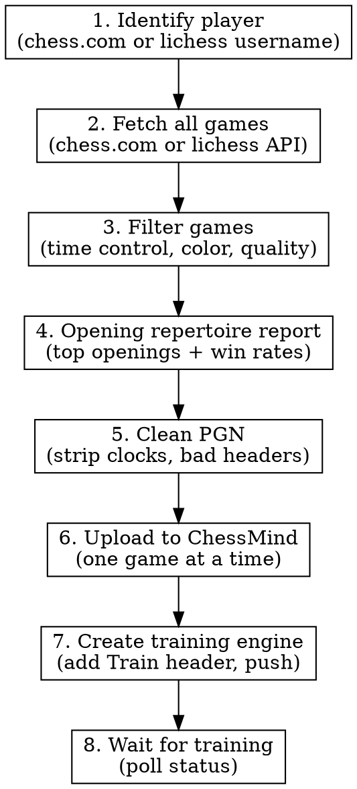

# ChessMind Training Bot

## Overview

End-to-end workflow for creating ChessMind training engines from a chess player's online games. Covers player identification, game fetching from chess.com and lichess.org, PGN cleaning, uploading to ChessMind, training engine creation, and opening repertoire analysis.

## When to Use

- User wants to create a ChessMind training engine from a player's games
- User wants to upload PGN games to their ChessMind account
- User wants to fetch and filter chess games from chess.com or lichess.org
- User wants to analyze a player's opening repertoire or success rates
- User mentions ChessMind, chessnutech.com, or training engines for chess

## Workflow



## Step 1: Identify Player

Determine whether the target player is on chess.com, lichess.org, or both.

### Chess.com
- User provides username directly, or search by name
- Verify: `GET https://api.chess.com/pub/player/{username}` returns `{name, country, url, ...}`

### Lichess
- User provides username directly
- Verify: `GET https://lichess.org/api/user/{username}` returns `{username, perfs, count, ...}`
- The `perfs` object contains rating/game count per time control (bullet, blitz, rapid, classical, etc.)
- **Note:** Lichess imported games (`count.import`) are NOT accessible via the games export API

## Step 2: Fetch Games

### From Chess.com

```bash
# Get list of all monthly archive URLs
curl -s "https://api.chess.com/pub/player/{username}/games/archives"
# Returns: {"archives": ["https://api.chess.com/pub/player/{username}/games/2024/01", ...]}

# Fetch each archive
curl -s "https://api.chess.com/pub/player/{username}/games/2024/01"
# Returns: {"games": [{pgn, time_control, white: {username, rating}, black: {username, rating}, ...}]}
```

**Game object fields:** `url`, `pgn`, `time_control`, `end_time`, `rated`, `time_class`, `rules`, `white` (username, rating, result), `black` (username, rating, result), `eco`

### From Lichess

```bash
# Export games as PGN (streaming)
curl -s -H 'Accept: application/x-chess-pgn' \
  'https://lichess.org/api/games/user/{username}?perfType=rapid&rated=true&opening=true&clocks=false&evals=false&max=500'

# Export games as NDJSON (one JSON object per line, better for filtering)
curl -s -H 'Accept: application/x-ndjson' \
  'https://lichess.org/api/games/user/{username}?perfType=rapid&rated=true&opening=true&max=500'
```

**Lichess query parameters:**

| Parameter | Values | Description |
|-----------|--------|-------------|
| `perfType` | `ultraBullet,bullet,blitz,rapid,classical,correspondence` | Filter by time control (comma-separated) |
| `rated` | `true/false` | Only rated games |
| `color` | `white/black` | Only games where user plays this color |
| `max` | integer | Maximum number of games to export |
| `since` | epoch ms | Games played since this timestamp |
| `until` | epoch ms | Games played until this timestamp |
| `opening` | `true/false` | Include opening name and ECO in response |
| `clocks` | `true/false` | Include clock comments in PGN moves |
| `evals` | `true/false` | Include engine eval comments in PGN moves |

**Lichess NDJSON game object fields:** `id`, `rated`, `variant`, `speed`, `perf`, `status`, `winner`, `opening` (`{eco, name, ply}`), `moves` (space-separated SAN), `players.white` (`{user, rating, ratingDiff}`), `players.black` (same), `clock` (`{initial, increment, totalTime}`)

**Lichess `status` values for wins:** `"mate"` (checkmate), `"resign"`, `"timeout"`, `"outoftime"`, `"stalemate"` (draw)

Cache all games to `/tmp/{username}_all_games.json` for reuse (works for both platforms).

## Step 3: Filter Games

Common filter criteria for "good" games:

| Criterion       | Typical Value                   | Chess.com Field | Lichess Field |
| --------------- | ------------------------------- | --------------- | ------------- |
| Time control    | rapid (10-min)                  | `time_control == "600"` | `speed == "rapid"` (or use `perfType` param) |
| Color           | white or black                  | `white.username` / `black.username` | `color` param, or `players.white.user.id` |
| Result          | win by checkmate or resignation | `result == "win"`, opponent `"checkmated"` or `"resigned"` | `winner == "white"/"black"` + `status == "mate"/"resign"` |
| Min moves       | 15+                             | Count moves in PGN | Count words in `moves` field / 2 |
| Opponent rating | 1000+                           | Opponent's `rating` field | `players.{opponent}.rating` |
| Max games       | 200 per training engine         | ChessMind limit | ChessMind limit |
| Min games       | 20 per training engine          | ChessMind limit | ChessMind limit |

**HARD CONSTRAINT:** ChessMind requires **between 20 and 200 games** per training engine. Fewer than 20 games will be rejected. More than 200 games will be rejected. If you have more than 200 qualifying games, select the best 200 (e.g., highest-rated opponents, most decisive wins). If you have fewer than 20, relax filter criteria (lower opponent rating threshold, include more time controls, include draws).

## Step 4: Opening Repertoire Report

**MANDATORY:** Before proceeding to upload/training, present a clear opening repertoire report to the user. This helps them understand the player's style and choose which openings to train.

Analyze games by opening and produce a formatted report for each color (white and black).

### Report format

Print the report in this exact format:

```
## Opening Repertoire Report: {username}

### As WHITE ({N} games, first move breakdown: {pct1}% 1.d4, {pct2}% 1.e4, ...)

| #  | Opening                  | Games | Win  | Draw | Loss | Win Rate |
|----|--------------------------|-------|------|------|------|----------|
| 1  | London System            |   120 |   72 |   12 |   36 |   60.0%  |
| 2  | Italian Game             |    85 |   45 |   10 |   30 |   52.9%  |
| 3  | Scotch Game              |    42 |   20 |    5 |   17 |   47.6%  |
| ...                                                                   |

### As BLACK ({N} games)

| #  | Opening                  | Games | Win  | Draw | Loss | Win Rate |
|----|--------------------------|-------|------|------|------|----------|
| 1  | Caro-Kann Defense        |   200 |  110 |   20 |   70 |   55.0%  |
| 2  | Sicilian Defense         |   150 |   75 |   15 |   60 |   50.0%  |
| ...                                                                   |
```

### Analysis code

```python
import re
from collections import defaultdict

def opening_report(games, username, platform='chess.com'):
    """Analyze openings with win/draw/loss stats.
    platform: 'chess.com' or 'lichess'"""
    
    stats = {'white': defaultdict(lambda: {'w': 0, 'd': 0, 'l': 0}),
             'black': defaultdict(lambda: {'w': 0, 'd': 0, 'l': 0})}
    first_moves = defaultdict(int)
    
    for g in games:
        if platform == 'chess.com':
            is_white = g['white']['username'].lower() == username.lower()
            color = 'white' if is_white else 'black'
            my_result = g['white']['result'] if is_white else g['black']['result']
            pgn = g.get('pgn', '')
            # Extract opening name from ECOUrl or ECO header
            name_match = re.search(r'\[ECOUrl "[^"]*/([\w-]+)"\]', pgn)
            eco_match = re.search(r'\[ECO "([^"]+)"\]', pgn)
            opening = name_match.group(1).replace('-', ' ').title() if name_match else (eco_match.group(1) if eco_match else 'Unknown')
            # Map result
            if my_result == 'win': outcome = 'w'
            elif my_result in ('checkmated', 'resigned', 'timeout', 'abandoned'): outcome = 'l'
            else: outcome = 'd'
            # First move for white games
            if color == 'white':
                m = re.search(r'\n\n1\.\s*(\S+)', pgn)
                if m: first_moves[f'1.{m.group(1)}'] += 1
        else:  # lichess
            is_white = g['players']['white']['user']['id'].lower() == username.lower()
            color = 'white' if is_white else 'black'
            winner = g.get('winner')
            if winner is None: outcome = 'd'
            elif (winner == 'white') == is_white: outcome = 'w'
            else: outcome = 'l'
            opening = g.get('opening', {}).get('name', 'Unknown')
            # First move
            if color == 'white':
                moves = g.get('moves', '')
                first = moves.split()[0] if moves else '?'
                first_moves[f'1.{first}'] += 1
        
        stats[color][opening][outcome] += 1
    
    # Print report
    for color in ['white', 'black']:
        entries = stats[color]
        total = sum(e['w'] + e['d'] + e['l'] for e in entries.values())
        print(f"\n### As {color.upper()} ({total} games", end="")
        if color == 'white' and first_moves:
            sorted_fm = sorted(first_moves.items(), key=lambda x: -x[1])
            fm_str = ', '.join(f'{pct:.1f}% {mv}' for mv, cnt in sorted_fm[:3] if (pct := cnt/total*100) > 1)
            print(f", first move breakdown: {fm_str}", end="")
        print(")\n")
        print(f"| # | Opening | Games | Win | Draw | Loss | Win Rate |")
        print(f"|---|---------|-------|-----|------|------|----------|")
        sorted_openings = sorted(entries.items(), key=lambda x: -(x[1]['w']+x[1]['d']+x[1]['l']))
        for i, (name, r) in enumerate(sorted_openings[:15], 1):
            total_g = r['w'] + r['d'] + r['l']
            wr = r['w'] / total_g * 100 if total_g else 0
            print(f"| {i} | {name} | {total_g} | {r['w']} | {r['d']} | {r['l']} | {wr:.1f}% |")
```

### Key points
- Show top 10-15 openings per color, sorted by game count
- Always include win rate percentage
- For white games, include first-move breakdown (1.e4 vs 1.d4 vs 1.c4 etc.)
- Group related ECO codes into opening families where possible (e.g., B10-B19 = Caro-Kann)
- Present the report to the user and ask which openings they want to train before proceeding

## Step 5: Clean PGN

ChessMind is strict about PGN format. Apply these transformations:

### Remove clock annotations (chess.com)

```
{[%clk 0:09:58.1]} -> (remove entirely)
```

**Lichess note:** Request games with `clocks=false&evals=false` to avoid clock/eval annotations entirely.

### Remove redundant black move numbers (chess.com)

```
1. e4 1... e5  ->  1. e4 e5
```

**Lichess note:** Lichess PGN does not include redundant black move numbers.

### Remove non-standard headers

**Chess.com** -- strip these:
- `CurrentPosition`, `Timezone`, `ECOUrl`, `Link`
- `StartTime`, `EndDate`, `EndTime`

**Lichess** -- strip these:
- `GameId`, `WhiteRatingDiff`, `BlackRatingDiff`
- `Variant` (when `"Standard"`), `Opening`
- `BlackBerserk`, `WhiteBerserk`

### Keep standard headers

- `Event`, `Site`, `Date`, `Round`, `White`, `Black`, `Result`
- `ECO`, `WhiteElo`, `BlackElo`, `TimeControl`
- `UTCDate`, `UTCTime`, `Termination`

### PGN cleaning in Python

```python
import re

def clean_pgn(pgn_text, platform='chess.com'):
    """Clean PGN for ChessMind compatibility.
    platform: 'chess.com' or 'lichess'"""
    
    if platform == 'chess.com':
        # Remove clock annotations
        pgn_text = re.sub(r'\s*\{[^}]*\[%clk[^}]*\}\s*', ' ', pgn_text)
        # Remove redundant black move numbers (e.g., "1... " after white's move)
        pgn_text = re.sub(r'\d+\.\.\.\s*', '', pgn_text)
        # Chess.com non-standard headers
        bad_headers = ['CurrentPosition', 'Timezone', 'ECOUrl', 'Link',
                       'StartTime', 'EndDate', 'EndTime']
    else:
        # Lichess non-standard headers
        bad_headers = ['GameId', 'WhiteRatingDiff', 'BlackRatingDiff',
                       'Variant', 'Opening', 'BlackBerserk', 'WhiteBerserk']
    
    for h in bad_headers:
        pgn_text = re.sub(rf'\[{h}\s+"[^"]*"\]\n?', '', pgn_text)
    
    # Collapse multiple spaces in move text
    lines = pgn_text.split('\n')
    cleaned = []
    for line in lines:
        if line.startswith('['):
            cleaned.append(line)
        else:
            cleaned.append(re.sub(r'  +', ' ', line).strip())
    return '\n'.join(cleaned).strip()
```

### Constructing PGN from Lichess NDJSON

If you fetched Lichess games as NDJSON (for filtering), you need to reconstruct PGN:

```python
def lichess_json_to_pgn(game):
    """Convert a Lichess NDJSON game object to PGN string."""
    headers = []
    headers.append(f'[Event "{game.get("tournament", "?")}"]')
    headers.append(f'[Site "https://lichess.org/{game["id"]}"]')
    # Convert epoch ms to date
    from datetime import datetime, timezone
    dt = datetime.fromtimestamp(game['createdAt'] / 1000, tz=timezone.utc)
    headers.append(f'[Date "{dt.strftime("%Y.%m.%d")}"]')
    headers.append('[Round "1"]')
    w = game['players']['white']
    b = game['players']['black']
    headers.append(f'[White "{w["user"]["name"]}"]')
    headers.append(f'[Black "{b["user"]["name"]}"]')
    winner = game.get('winner')
    result = '1-0' if winner == 'white' else ('0-1' if winner == 'black' else '1/2-1/2')
    headers.append(f'[Result "{result}"]')
    headers.append(f'[WhiteElo "{w.get("rating", "?")}"]')
    headers.append(f'[BlackElo "{b.get("rating", "?")}"]')
    clock = game.get('clock', {})
    tc = f'{clock.get("initial", 0)}+{clock.get("increment", 0)}' if clock else '?'
    headers.append(f'[TimeControl "{tc}"]')
    headers.append(f'[UTCDate "{dt.strftime("%Y.%m.%d")}"]')
    headers.append(f'[UTCTime "{dt.strftime("%H:%M:%S")}"]')
    eco = game.get('opening', {}).get('eco', '?')
    headers.append(f'[ECO "{eco}"]')
    term_map = {'mate': 'Normal', 'resign': 'Normal', 'timeout': 'Time forfeit',
                'outoftime': 'Time forfeit', 'stalemate': 'Normal', 'draw': 'Normal'}
    headers.append(f'[Termination "{term_map.get(game.get("status", ""), "Normal")}"]')
    
    # Build move text with move numbers
    moves_raw = game.get('moves', '').split()
    move_text = ''
    for i, move in enumerate(moves_raw):
        if i % 2 == 0:
            move_text += f'{i // 2 + 1}. {move} '
        else:
            move_text += f'{move} '
    move_text += result
    
    return '\n'.join(headers) + '\n\n' + move_text.strip()
```

## Step 5: Upload to ChessMind

### Authentication

ChessMind uses token-based auth injected into POST body (not headers).

| Parameter | Description                     |
| --------- | ------------------------------- |
| `user_id` | Numeric user ID (e.g., `46475`) |
| `token`   | Auth token string               |

Both are sent as form-encoded body fields on every request.

### API Base URL

**CRITICAL:** Base URL is `https://api.chessnutech.com` (NOT `https://chessmind.chessnutech.com` -- that is the frontend only and returns 404 for API calls).

### Required Headers

```
Content-Type: application/x-www-form-urlencoded;charset=UTF-8
Origin: https://chessmind.chessnutech.com
Referer: https://chessmind.chessnutech.com/
```

### Upload games one at a time

```bash
curl -s -X POST 'https://api.chessnutech.com/api/uploadPgnList' \
  -H 'Content-Type: application/x-www-form-urlencoded;charset=UTF-8' \
  -H 'Origin: https://chessmind.chessnutech.com' \
  -H 'Referer: https://chessmind.chessnutech.com/' \
  -d "user_id={USER_ID}&token={TOKEN}&pgnList={URL_ENCODED_PGN}"
```

**Upload one game per request.** Add ~0.3s delay between uploads to avoid rate limiting.

Response: `{"ret": 1, "code": 200, "info": "OK", "data": {...}}`

## Step 6: Create Training Engine

### Add Train header to each PGN

Insert `[Train "w"]` (for white games) or `[Train "b"]` (for black games) after the last PGN header line, before the move text.

```python
def add_train_header(pgn, color):
    """color: 'w' for white, 'b' for black"""
    lines = pgn.split('\n')
    last_header_idx = -1
    for i, line in enumerate(lines):
        if line.startswith('['):
            last_header_idx = i
    if last_header_idx >= 0:
        lines.insert(last_header_idx + 1, f'[Train "{color}"]')
    return '\n'.join(lines)
```

### Concatenate and push

```python
# Combine all PGNs with double newline separator
combined = '\n\n'.join(modified_pgns)

# Push training
# POST /api/train/push with {pgn: combined, title: "Engine Name", remark: "Engine Name"}
```

```bash
curl -s -X POST 'https://api.chessnutech.com/api/train/push' \
  -H 'Content-Type: application/x-www-form-urlencoded;charset=UTF-8' \
  -H 'Origin: https://chessmind.chessnutech.com' \
  -H 'Referer: https://chessmind.chessnutech.com/' \
  -d "user_id={USER_ID}&token={TOKEN}&pgn={URL_ENCODED_COMBINED}&title={TITLE}&remark={REMARK}"
```

### Training limits

- **HARD LIMIT: Exactly 20-200 games.** The API rejects payloads with fewer than 20 or more than 200 games. Always verify game count before calling `train/push`.
- **Only ONE training can be in progress at a time** -- attempting to create a second returns 501 error
- Must wait for current training to complete or delete it before starting a new one

## Step 7: Monitor Training Status

```bash
curl -s -X POST 'https://api.chessnutech.com/api/train/list' \
  -H 'Content-Type: application/x-www-form-urlencoded;charset=UTF-8' \
  -H 'Origin: https://chessmind.chessnutech.com' \
  -H 'Referer: https://chessmind.chessnutech.com/' \
  -d "user_id={USER_ID}&token={TOKEN}"
```

| train_status | Meaning              |
| ------------ | -------------------- |
| 0            | Queued               |
| 1            | Training in progress |
| 2            | Completed            |

## ChessMind API Reference

| Endpoint                    | Purpose                         | Key Params                                                            |
| --------------------------- | ------------------------------- | --------------------------------------------------------------------- |
| `POST /api/getPgnList`      | List uploaded PGNs (paginated)  | `page`, `filter`                                                      |
| `POST /api/uploadPgn`       | Upload single PGN with metadata | `pgn`, `white_name`, `black_name`, `play_time`, `play_mode`           |
| `POST /api/uploadPgnList`   | Upload PGN text                 | `pgnList` (single game PGN string)                                    |
| `POST /api/updatePgn`       | Update existing PGN             | `pgn_id`, `pgn`, `white_name`, `black_name`, `play_time`, `play_mode` |
| `POST /api/delPgn`          | Delete single PGN               | `pgn_id`                                                              |
| `POST /api/delPgns`         | Batch delete PGNs               | `pgn_id` (comma-separated IDs)                                        |
| `POST /api/train/list`      | List training engines           | (none)                                                                |
| `POST /api/train/push`      | Create new training             | `pgn`, `title`, `remark`                                              |
| `POST /api/train/del`       | Delete training                 | `train_id` (NOT `id`)                                                 |
| `POST /api/train/status`    | Check training status           | `id`                                                                  |
| `POST /api/train/subStatus` | Check subscription              | (none)                                                                |

All endpoints require `user_id` and `token` in the POST body.

## Common Mistakes

| Mistake                                        | Fix                                           |
| ---------------------------------------------- | --------------------------------------------- |
| Using `chessmind.chessnutech.com` as API base  | Use `api.chessnutech.com`                     |
| Sending auth in headers                        | Send `user_id` and `token` in POST body       |
| Uploading multiple games in one request        | Upload one game per `uploadPgnList` call      |
| Leaving clock annotations in PGN               | Strip `{[%clk ...]}` patterns                 |
| Leaving `1...` black move numbers             | Remove redundant `\d+\.\.\.\s*`               |
| Creating training while another is in progress | Check `train/list` first; wait or delete      |
| Using `id` param for `train/del`               | Use `train_id` parameter                      |
| Sending JSON content type                      | Use `application/x-www-form-urlencoded`       |
| Forgetting Origin/Referer headers              | Include both from `chessmind.chessnutech.com` |

## Opening Analysis

To analyze a player's opening repertoire from cached game data:

```python
from collections import Counter

def analyze_openings(games, username, color='white'):
    """Analyze opening frequency for a player.
    color: 'white' or 'black' - which side the player plays"""
    eco_counter = Counter()
    for g in games:
        player_side = 'white' if g['white']['username'].lower() == username.lower() else 'black'
        if player_side != color:
            continue
        pgn = g.get('pgn', '')
        eco_match = re.search(r'\[ECO "([^"]+)"\]', pgn)
        name_match = re.search(r'\[ECOUrl "[^"]*/([\w-]+)"\]', pgn)
        if eco_match:
            eco = eco_match.group(1)
            name = name_match.group(1).replace('-', ' ').title() if name_match else eco
            eco_counter[name] += 1
    return eco_counter.most_common(10)
```
