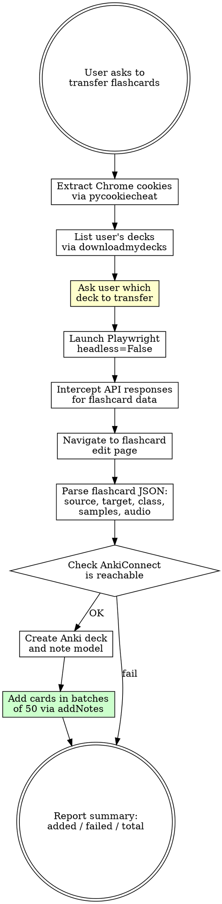

# HungarianPod101 Flashcards to Anki

## Overview

Download flashcard decks from a user's HungarianPod101 account via the `flashcards.languagepod101.com` sync API, then create Anki cards via AnkiConnect. Cards include Hungarian word, English translation, part of speech, and example sentences (both directions).

## Prerequisites

- User must be **logged into HungarianPod101 in Chrome**
- **Anki desktop** must be running with **AnkiConnect** addon (code: `2055492159`)
- Python packages: `pycookiecheat`, `playwright`

Verify AnkiConnect:
```bash
curl -s http://localhost:8765 -X POST -d '{"action":"version","version":6}'
```
Expected: `{"result":6,"error":null}`

If connection refused: user must **restart Anki** after installing AnkiConnect addon.

## Workflow



## Step 1: List Decks and Ask User Which to Transfer

**Always list the user's available decks first and ask which one to transfer**, even if they mentioned a deck name. This avoids transferring the wrong deck.

Use Playwright to navigate to the flashcards page and intercept the `downloadmydecks` response:

```python
# Intercept the downloadmydecks response (same Playwright pattern as Step 2)
# The response contains:
# {"decks": [{"id": "4178266", "title": "beginner", ...}, ...]}
```

Present the decks to the user and ask them to pick one. Use the `question` tool with options listing each deck by title. If the user already provided a deck URL or name, confirm it matches before proceeding.

Example deck listing response:
```json
{"decks": [
  {"id": "4178265", "title": "New Core 100 Deck", "language": "hungpod101"},
  {"id": "4178266", "title": "beginner", "language": "hungpod101"}
]}
```

## Step 2: Extract Flashcards via Playwright

The flashcard system is a JavaScript SPA at `flashcards.languagepod101.com`. **Must use Playwright with `headless=False`** (headless mode gets stuck on "Loading" due to bot detection).

The API uses three key endpoints (all POST to `flashcards.languagepod101.com`):

| Endpoint | Purpose | Auth |
|----------|---------|------|
| `/sync/getsettings` | User flashcard settings | Chrome cookies |
| `/sync/downloadmydecks` | List all user decks with IDs and titles | Chrome cookies |
| `/sync/downloadflashcardsofdeck` | Download all cards for a deck | Chrome cookies |

### Scraping Strategy

Intercept network responses from Playwright rather than calling the API directly (direct requests return 403):

```python
import asyncio, json
from playwright.async_api import async_playwright
from pycookiecheat import chrome_cookies

async def download_flashcards(deck_id):
    cookies = chrome_cookies("https://www.hungarianpod101.com")
    flashcard_data = None

    async with async_playwright() as p:
        browser = await p.chromium.launch(headless=False)
        context = await browser.new_context()

        # Inject cookies for both domains
        for domain in [".hungarianpod101.com", ".languagepod101.com"]:
            await context.add_cookies([
                {"name": k, "value": v, "domain": domain, "path": "/"}
                for k, v in cookies.items()
            ])

        page = await context.new_page()

        async def handle_response(response):
            nonlocal flashcard_data
            if 'downloadflashcardsofdeck' in response.url:
                body = await response.text()
                flashcard_data = json.loads(body)

        page.on("response", handle_response)

        await page.goto(
            f"https://www.hungarianpod101.com/learningcenter/flashcards/flashcards#/edit/{deck_id}",
            wait_until="networkidle",
            timeout=60000
        )
        await asyncio.sleep(5)
        await browser.close()

    return flashcard_data
```

### Flashcard JSON Structure

Each card in the `flashcards` array:

```json
{
  "id": "240786",
  "createdAt": "2011-08-05 19:00:00",
  "updatedAt": "2026-01-10 14:42:09",
  "flashcardmodelId": "183",
  "source": "hungpod101 lesson 2234",
  "content": "{\"source\":\"szoknya\",\"target\":\"skirt\",\"audio\":\"https://d1pra95f92lrn3.cloudfront.net/audio/404046.mp3\",\"class\":\"noun\",\"samples\":{\"fields\":[\"Source\",\"English\"],\"samples\":[{\"Source\":\"sötét rózsaszín szoknya\",\"English\":\"dark pink skirt\",\"Audio\":\"...\"}]}}"
}
```

The `content` field is a **JSON string** that must be parsed separately. Fields inside `content`:

| Field | Description | Example |
|-------|-------------|---------|
| `source` | Hungarian word/phrase | `szoknya` |
| `target` | English translation | `skirt` |
| `audio` | Audio URL on CloudFront CDN | `https://d1pra95f92lrn3.cloudfront.net/audio/404046.mp3` |
| `class` | Part of speech | `noun`, `verb`, `adjective`, `expression`, `adverb` |
| `samples.samples[]` | Example sentences | `[{"Source": "...", "English": "...", "Audio": "..."}]` |

### Parsing Cards

```python
parsed_cards = []
for card in flashcard_data['flashcards']:
    content = json.loads(card.get('content', '{}'))
    parsed_cards.append({
        'source': content.get('source', ''),      # Hungarian
        'target': content.get('target', ''),      # English
        'audio': content.get('audio', ''),
        'pos': content.get('class', ''),
        'example_hu': '',
        'example_en': '',
    })
    samples = content.get('samples', {}).get('samples', [])
    if samples:
        parsed_cards[-1]['example_hu'] = samples[0].get('Source', '')
        parsed_cards[-1]['example_en'] = samples[0].get('English', '')
```

## Step 3: Create Anki Deck and Note Model

Create a custom note model with two card templates (Hungarian->English and English->Hungarian):

```python
import json, urllib.request

def anki_request(action, **params):
    payload = json.dumps({"action": action, "version": 6, "params": params})
    req = urllib.request.Request(
        'http://127.0.0.1:8765',
        data=payload.encode(),
        headers={'Content-Type': 'application/json'}
    )
    resp = urllib.request.urlopen(req, timeout=30)
    return json.loads(resp.read().decode())

# Create deck
anki_request("createDeck", deck="<DECK_NAME>")

# Create bidirectional note model
anki_request("createModel",
    modelName="HungarianPod101",
    inOrderFields=["Hungarian", "English", "PartOfSpeech", "ExampleHU", "ExampleEN", "Audio"],
    css=""".card { font-family: arial; font-size: 20px; text-align: center; }
.pos { color: #888; font-size: 14px; font-style: italic; margin-top: 8px; }
.example { font-size: 14px; color: #555; margin-top: 12px; }""",
    isCloze=False,
    cardTemplates=[
        {
            "Name": "Hungarian -> English",
            "Front": "{{Hungarian}}<div class='pos'>{{PartOfSpeech}}</div>",
            "Back": "{{FrontSide}}<hr id=answer>{{English}}"
                    "<div class='example'>{{ExampleHU}}<br>{{ExampleEN}}</div>"
        },
        {
            "Name": "English -> Hungarian",
            "Front": "{{English}}<div class='pos'>{{PartOfSpeech}}</div>",
            "Back": "{{FrontSide}}<hr id=answer>{{Hungarian}}"
                    "<div class='example'>{{ExampleHU}}<br>{{ExampleEN}}</div>"
        }
    ]
)
```

## Step 4: Add Cards in Batches

**CRITICAL:** `addNotes` with audio downloads times out on large batches. Add cards in batches of **50** with a 2-second pause between batches. If audio download is not needed, batches of 100 work fine.

```python
import time

BATCH_SIZE = 50

for i in range(0, len(parsed_cards), BATCH_SIZE):
    batch = parsed_cards[i:i+BATCH_SIZE]
    notes = []
    for card in batch:
        if not card['source'] or not card['target']:
            continue
        note = {
            "deckName": "<DECK_NAME>",
            "modelName": "HungarianPod101",
            "fields": {
                "Hungarian": card['source'],
                "English": card['target'],
                "PartOfSpeech": card['pos'],
                "ExampleHU": card['example_hu'],
                "ExampleEN": card['example_en'],
                "Audio": "",
            },
            "options": {"allowDuplicate": False, "duplicateScope": "deck"},
            "tags": ["hungarianpod101"],
        }
        # Optional: download audio (causes slow batches)
        if card.get('audio'):
            safe_name = card['source'].replace(' ', '_').replace('/', '_')
            note["audio"] = [{
                "url": card['audio'],
                "filename": f"hungpod_{safe_name}.mp3",
                "fields": ["Audio"]
            }]
        notes.append(note)

    result = anki_request("addNotes", notes=notes)
    ids = result['result']
    success = sum(1 for x in ids if x is not None)
    failed = sum(1 for x in ids if x is None)
    print(f"Batch {i//BATCH_SIZE + 1}: {success} added, {failed} skipped")
    time.sleep(2)
```

## Quick Reference

| Item | Value |
|------|-------|
| Flashcard API host | `flashcards.languagepod101.com` |
| Flashcard API auth | Chrome cookies (both `.hungarianpod101.com` and `.languagepod101.com`) |
| Key endpoint | `POST /sync/downloadflashcardsofdeck` |
| Deck listing endpoint | `POST /sync/downloadmydecks` |
| Audio CDN | `d1pra95f92lrn3.cloudfront.net` |
| AnkiConnect port | `8765` |
| AnkiConnect addon code | `2055492159` |
| Headless mode | **Does NOT work** - must use `headless=False` |
| Batch size for addNotes | 50 (with audio), 100 (without audio) |
| Dependencies | `pycookiecheat`, `playwright` |
| Direct API calls | Return 403 - must intercept via Playwright |

## Common Mistakes

| Mistake | Fix |
|---------|-----|
| Calling flashcard API directly with requests | Returns 403. Must intercept responses via Playwright navigation. |
| Using `headless=True` with Playwright | SPA stuck on "Loading". Must use `headless=False`. |
| Adding all cards in one `addNotes` call | Times out when downloading audio for 500+ cards. Use batches of 50. |
| Not injecting cookies to `.languagepod101.com` | Flashcard API is on a different domain; needs cookies on both domains. |
| Forgetting to parse `content` field as JSON | The `content` field inside each flashcard is a JSON string, not an object. |
| AnkiConnect not responding after addon install | User must **restart Anki** for addon to activate. |
| Not checking if note model already exists | `createModel` fails if model exists. Check `modelNames` first. |
| Using "Basic" model for bidirectional cards | Use a custom model with two templates, or "Basic (and reversed card)". |
| Assuming which deck to transfer without asking | Always list decks first and ask the user to pick, even if they named one. |
