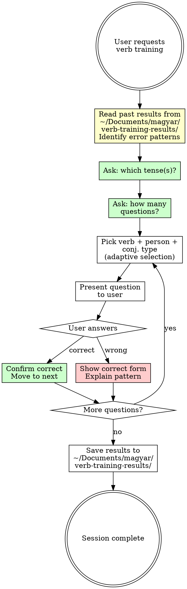

# Hungarian Verb Trainer

## Overview

Train the user on Hungarian verb conjugation through interactive quiz sessions. The agent picks verbs and asks the user to conjugate them in specific tenses, persons, and conjugation types (definite/indefinite). Questions are adapted based on past mistakes to reinforce weak areas.

## Session Flow



### 1. Review Past Results (Adaptive Selection)

Before starting, read ALL results files from `~/Documents/magyar/verb-training-results/`. Analyze:

1. **Which verbs were answered incorrectly** and what the specific errors were
2. **Categorize each error** into a grammatical pattern (see Error Categories below)
3. **Identify verbs from the same family** — verbs that follow the same grammatical rules as the ones the user got wrong

**Error Categories:**

| Category | Description | Example errors |
|----------|-------------|----------------|
| Back/front vowel tárgyas endings | Using -i/-ik/-itek on back-vowel verbs or vice versa | hallani→halli, mutatni→mutati |
| Consonant assimilation | Not assimilating z+j→zz, s+j→ss, etc. | főzni→főzjük, érezni→érezjük |
| Alanyi vs tárgyas confusion | Giving alanyi form when tárgyas asked or vice versa | adni→adsz (alanyi) instead of adod (tárgyas) |
| Sibilant stem E/2 | Using -sz instead of -ol/-el/-öl after sibilant stems | olvasni→olvassz instead of olvasol |
| Irregular stems | Wrong stem for irregular verbs | menni→megytek instead of mentek |
| Present/past confusion | Giving past forms instead of present or vice versa | jönni→jöttek instead of jöttök |
| Vowel harmony in endings | Wrong linking vowel (back vs front) | próbálni→próbálünk instead of próbálunk |
| Transparent vowels | Mishandling í/é as harmony-determining | tanítani→tanítik instead of tanítják |

**Adaptive Question Selection:**

Approximately **half the questions** should target the user's weak areas by picking **different verbs from the same grammatical family** as previously-missed verbs. The key rule:

> **Do NOT re-test the exact same verb+person+conjugation that was missed.** Instead, pick a DIFFERENT verb that follows the same grammatical rule, to test whether the user has learned the pattern (not just memorized one form).

**Examples of "same family" substitutions:**

| Original error | Rule being tested | Alternative verb to use |
|----------------|-------------------|------------------------|
| hallani E/3 tárgyas (back-vowel, -ja) | Back-vowel E/3 tárgyas ending | mondani, várni, kapni, zárni |
| főzni T/1 tárgyas (z+j assimilation) | Consonant assimilation with -z stem | hozni, érezni, nézni, vezet |
| olvasni E/2 alanyi (sibilant stem) | Sibilant stem E/2 alanyi (-ol/-el not -sz) | főzni, hozni, keresni, nézni |
| menni T/2 alanyi (irregular stem) | Irregular stem that changes across persons | jönni, enni, inni, venni, vinni |
| tanítani T/3 tárgyas (transparent í) | Transparent vowel + back-vowel harmony | segíteni→NOT (front), nyitni, hívni |

The remaining questions should be randomly selected to maintain breadth.

### 2. Ask Tense Selection

Present these options to the user:

| Option | Hungarian | Description |
|--------|-----------|-------------|
| 1 | Jelen idő | Present tense |
| 2 | Múlt idő | Past tense |
| 3 | Jövő idő | Future tense (fog + infinitive, except lenni) |
| 4 | Feltételes mód | Conditional mood |
| 5 | Felszólító mód | Imperative / subjunctive mood |
| 6 | Minden | All tenses (random selection each question) |

### 3. Ask Session Length

Ask the user how many questions they want (e.g., 10, 20, 50).

### 4. Run the Quiz

For each question:
1. Pick a verb (adaptive or random — see Adaptive Selection above)
2. Pick a **random person**: én, te, ő/ön, mi, ti, ők/önök
3. Pick a **random conjugation type**: alanyi (indefinite) or tárgyas (definite)
4. Pick a **random tense** (from the user's selection)
5. Present the question clearly:

**Format:**
```
[Q3/20] Conjugate "látni" (to see)
Tense: jelen idő (present)
Person: én (I)
Conjugation: tárgyas (definite)
```

6. Wait for the user's answer
7. Check correctness:
   - If **correct**: confirm and move on
   - If **wrong**: show the correct form and **explain in English why the answer was wrong**

### Error Explanations (MANDATORY)

When the user gives an incorrect answer, you MUST explain **in English** what went wrong. Do NOT just show the correct form — explain the **specific grammatical reason** for the error. This is the most valuable part of the training.

**Types of explanations to give:**

| Error Type | Example Explanation |
|------------|---------------------|
| Vowel harmony | "This verb has a back-vowel stem (lát-), so the suffix uses back vowels: -om, not -em." |
| Wrong personal ending | "For én in tárgyas present tense, the ending is -om/-em/-öm, not -ok/-ek/-ök. You used the alanyi ending." |
| Alanyi vs tárgyas confusion | "The question asked for tárgyas (definite), but 'olvasok' is the alanyi form. The tárgyas form is 'olvasom'." |
| Ik-verb specifics | "Eszik is an ik-verb. In E/3 alanyi present, ik-verbs end in -ik: eszik, not *esz." |
| Irregular stem | "Menni has an irregular stem: the present tense uses megy-, not men-. So it's megyek, not *menek." |
| Consonant assimilation | "In felszólító mód, the -j assimilates with the final -t of the stem: lát + -ja becomes lássa (t+j → ss)." |
| Tense marker errors | "In múlt idő, the tense marker for this verb is -ott (back vowel after consonant cluster): látott, not *látt." |
| Future tense exceptions | "Lenni doesn't use 'fog + infinitive'. It has its own future forms: leszek, leszel, lesz, etc." |

**Rules for explanations:**
- Always explain in **English** (the user is learning Hungarian)
- Be **specific** to the actual mistake (don't give generic grammar lectures)
- Name the grammatical concept (vowel harmony, ik-verb, consonant assimilation, etc.)
- When relevant, show the **pattern** so the user can generalize (e.g., "back-vowel verbs always use -om/-od/-ja in tárgyas")
- Keep it concise: 1-3 sentences maximum

## Hungarian Conjugation Reference

### Persons

| Person | Hungarian | English |
|--------|-----------|---------|
| E/1 | én | I |
| E/2 | te | you (informal) |
| E/3 | ő / ön | he/she/it / you (formal) |
| T/1 | mi | we |
| T/2 | ti | you (plural) |
| T/3 | ők / önök | they / you (formal plural) |

### Conjugation Types

- **Alanyi (indefinite):** used when there is no definite direct object (e.g., "I read a book" -- olvasok egy könyvet)
- **Tárgyas (definite):** used when the direct object is definite (e.g., "I read the book" -- olvasom a könyvet)

### Tense/Mood Overview

**Jelen idő (present):** Base conjugation. Back-vowel vs front-vowel endings differ.

**Múlt idő (past):** Add `-t`/`-tt`/`-ott`/`-ett`/`-ött` to stem + personal endings.

**Jövő idő (future):** `fog` + infinitive for most verbs.
- **Exception: lenni** -- uses its own future forms: leszek, leszel, lesz, leszünk, lesztek, lesznek (no `fog` needed).

**Feltételes mód (conditional):** Add `-na`/`-ne`/`-ná`/`-né` to stem + personal endings.

**Felszólító mód (imperative/subjunctive):** Add `-j`/`-jj` (with consonant assimilation rules) + personal endings.

### Key Irregularities to Know

| Verb | Type | Notes |
|------|------|-------|
| lenni | highly irregular | Special forms in all tenses. Future: leszek, not *fog lenni |
| menni | irregular | megyek, mész, megy... |
| jönni | irregular | jövök, jössz, jön... |
| enni | irregular | eszek, eszel, eszik... |
| inni | irregular | iszok, iszol, iszik... |
| venni | irregular | veszek, veszel, vesz... |
| vinni | irregular | viszek, viszel, visz... |
| hinni | irregular | hiszek, hiszel, hisz... |
| tenni | irregular | teszek, teszel, tesz... |

### Important Note on Correctness

You (the agent) must **know the correct conjugation** to verify the user's answer. Hungarian conjugation has many irregular verbs and subtle rules. If you are unsure of a form:
- State clearly that you're not 100% certain
- Provide your best answer with a caveat
- Never silently accept a wrong answer or reject a correct one

## Results Tracking

At the end of each session, save a results file to `~/Documents/magyar/verb-training-results/`. Create the directory if it doesn't exist.

**Filename format:** `YYYY-MM-DD-HHmm-results.md`

**Content format:**

```markdown
# Verb Training Results - YYYY-MM-DD HH:MM

## Summary
- **Tense(s):** [selected tense(s)]
- **Questions:** [total]
- **Correct:** [count] ([percentage]%)
- **Wrong:** [count] ([percentage]%)

## Detailed Results

| # | Verb | Tense | Person | Conj. | Your Answer | Correct Answer | Result |
|---|------|-------|--------|-------|-------------|----------------|--------|
| 1 | látni | jelen idő | én | tárgyas | látom | látom | ✅ |
| 2 | menni | múlt idő | ő | alanyi | ment | ment | ✅ |
| 3 | enni | jelen idő | te | alanyi | esz | eszel | ❌ |

### Explanations for Wrong Answers

**Q3 — enni, jelen idő, te, alanyi:** Eszik is an ik-verb. For te in alanyi present, the ending is -el: eszel, not esz. The bare stem form "esz" doesn't exist as a standalone conjugated form.

## Verbs to Review
- enni (to eat) -- struggled with present tense alanyi forms
```

## Common Mistakes (Agent)

| Mistake | Fix |
|---------|-----|
| Not reviewing past results before starting | Always read ~/Documents/magyar/verb-training-results/ first |
| Re-testing exact same verb+person+conj that was missed | Use a DIFFERENT verb from the same grammatical family |
| Using `fog lenni` for future of lenni | lenni has its own future: leszek, leszel, lesz... |
| Accepting wrong answers silently | Always verify against known conjugation tables |
| Not saving results at session end | Always save to ~/Documents/magyar/verb-training-results/ |
| Asking all questions at once | One question at a time, wait for user's answer |
| Mixing up alanyi and tárgyas | Clearly state which conjugation type in each question |
| Showing correct answer without explanation | ALWAYS explain in English WHY the answer was wrong (see Error Explanations section) |
| Giving generic grammar explanations | Be specific to the user's actual mistake, not a general lecture |
| Making ALL questions adaptive | Keep ~50% random for breadth; only ~50% target weak areas |
