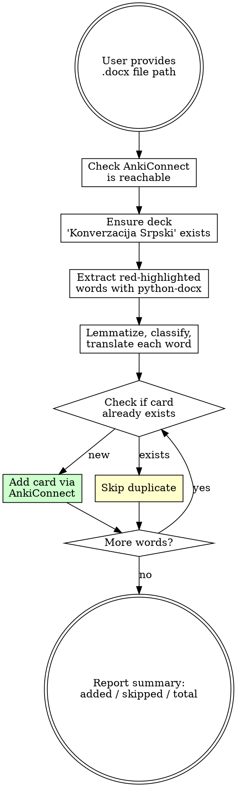

# Serbian Vocab-to-Anki

## Overview

Extract red-highlighted unknown words from Serbian lesson .docx files, lemmatize them, translate to English, and add them as flashcards to the Anki deck "Konverzacija Srpski" via AnkiConnect. Each card uses the "Basic (and reversed card)" model so the user is tested in both directions.

## Prerequisites

- **Anki** must be running with **AnkiConnect** addon (code: 2055492159)
- **python-docx** must be installed: `pip3 install python-docx`

Verify AnkiConnect:
```bash
curl -s http://localhost:8765 -X POST -d '{"action":"version","version":6}'
```
Expected: `{"result":6,"error":null}`

## Workflow



### 1. Check AnkiConnect

```bash
curl -s http://localhost:8765 -X POST -d '{"action":"version","version":6}'
```

If not reachable, tell user to open Anki.

### 2. Ensure Deck Exists

```bash
curl -s http://localhost:8765 -X POST -d '{
  "action": "createDeck",
  "version": 6,
  "params": {"deck": "Konverzacija Srpski"}
}'
```

### 3. Extract Red-Highlighted Words

Run this Python script to extract words with red highlighting:

```python
from docx import Document
from docx.oxml.ns import qn

doc = Document("<FILE_PATH>")
red_words = []
for para in doc.paragraphs:
    for run in para.runs:
        text = run.text.strip()
        if text:
            rpr = run._element.find(qn('w:rPr'))
            if rpr is not None:
                hl = rpr.find(qn('w:highlight'))
                if hl is not None and hl.get(qn('w:val')) == 'red':
                    red_words.append(text)

for w in red_words:
    print(w)
```

### 4. Lemmatize, Classify, and Translate

For each extracted word, apply your Serbian linguistic knowledge:

**Nouns:** Convert to nominative singular.
- Example: "objašnjenjem" (instrumental) -> "objašnjenje"

**Verbs:** Convert to infinitive. Find the **aspectual pair** (imperfective + perfective). Format both on the front card:
- Example: "dosađuje" (3p present) -> "dosađivati (imperf) / dosaditi (perf)"
- Example: "iskulirati" -> "kulirati (imperf) / iskulirati (perf)"
- If only one aspect exists, use just that form with its aspect label

**Adjectives/adverbs:** Convert to base form (masculine nominative singular for adjectives).
- Example: "naporno" (neuter/adverb) -> "naporan" if adjective, or "naporno" if used as adverb

**Multi-word expressions:** Keep as-is if idiomatic.
- Example: "soma dinara" stays as "soma dinara"

**Slang detection:** If the word is slang/colloquial, add `(sleng)` annotation to the Front field.

### 5. Check for Duplicates

Before adding each card, check if it already exists:

```bash
curl -s http://localhost:8765 -X POST -d '{
  "action": "findNotes",
  "version": 6,
  "params": {"query": "deck:\"Konverzacija Srpski\" front:\"<FRONT_TEXT>\""}
}'
```

If result array is non-empty, skip this word.

### 6. Add Card to Anki

```bash
curl -s http://localhost:8765 -X POST -d '{
  "action": "addNote",
  "version": 6,
  "params": {
    "note": {
      "deckName": "Konverzacija Srpski",
      "modelName": "Basic (and reversed card)",
      "fields": {
        "Front": "<SERBIAN>",
        "Back": "<ENGLISH>"
      },
      "options": {
        "allowDuplicate": false
      },
      "tags": ["srpski", "vokabular"]
    }
  }
}'
```

For slang words, add the `sleng` tag:
```json
"tags": ["srpski", "vokabular", "sleng"]
```

### 7. Report Summary

After processing all words, report:
- Total red-highlighted words found
- Cards added (with list)
- Cards skipped as duplicates (with list)
- Any words that could not be processed (with explanation)

## Card Format Reference

| Word Type | Front (Serbian) | Back (English) |
|---|---|---|
| Regular noun | `objašnjenje` | `explanation` |
| Slang noun | `gajba (sleng)` | `house, home, crib` |
| Verb pair | `dosađivati (imperf) / dosaditi (perf)` | `to annoy, to bore` |
| Slang verb pair | `cirkati (imperf) / cirknuti (perf) (sleng)` | `to drink (alcohol), to booze` |
| Adjective | `naporan` | `strenuous, tiresome, exhausting` |
| Multi-word | `soma dinara (sleng)` | `a thousand dinars` |
| Adverb | `opušteno` | `relaxed, chill, easy-going` |

## Common Mistakes

| Mistake | Fix |
|---------|-----|
| Not checking AnkiConnect before starting | Always verify connectivity first |
| Adding duplicate cards | Check with `findNotes` before `addNote` |
| Leaving verbs in conjugated form | Always lemmatize to infinitive |
| Missing the aspectual pair for verbs | Always provide both imperfective and perfective |
| Not marking slang words | Check if word is colloquial/slang, add `(sleng)` |
| Using font color instead of highlight | Red = `<w:highlight w:val="red"/>`, NOT `<w:color>` |
| Forgetting reversed cards | Use model "Basic (and reversed card)", not "Basic" |
